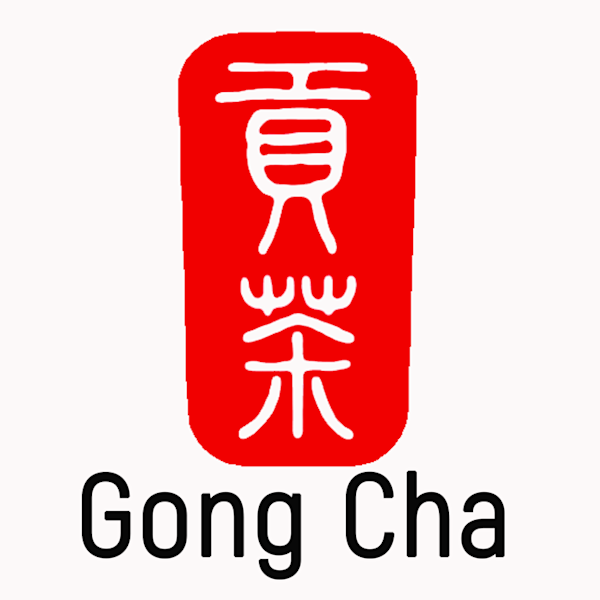

# Gong Cha Drink Store Data Analytics

 

    

## Overview

This repository contains the data analytics project for Gong Cha Drink Store, designed and implemented as part of the "INFO601 Database Modelling and SQL" course. The primary aim is to provide actionable insights into Gong Cha's sales performance using Power BI.

## Repository Structure

- 📁 `Dashboard Design Images`: Contains three hand-drawn design images illustrating the initial design and layout of the Power BI dashboard:
  - `Main Dashboard Page`: Initial design for the primary dashboard showcasing key metrics.
  - `The First Issue Page`: Design focused on visualizing the sales issues related to the tea category.
  - `The Second Issue Page`: Design highlighting sales performance issues in medium-sized cities.
  
- 📊 `Drink Store Data Analytics.pbix`: This is the main Power BI project file, showcasing various visuals and insights based on the provided dataset. 
- 📈 `Drink Store Dataset.xlsx`: The dataset used for this analytics project, containing data related to products, sales, expenses, and other key metrics.
- 📝 `Visualizations Research Report.docx`: A detailed description of the Power BI dashboard, its visuals, the rationale behind each visual choice, and the insights drawn from the data.
- 🖼️ `logo.png`: The official logo of the Gong Cha Drink Store.

## Project Details

### Key Performance Indicators (KPIs) Questions:

1. What were the total sales amount, total expenses, and total number of orders for each store in different cities during the two year of 2016 and 2017?
2. What were the total sales amount and total sales quantity for all stores every month in 2016 and 2017?
3. Do males or females have a higher preference for purchasing drink products? What is the proportion of sales quantities corresponding to males and females?
4. What were the total sales amount for each product and each product category?

For a detailed breakdown of each KPI question, the visuals used to answer them, and the insights derived, please refer to the `Visualizations Research Report.docx`.

### Issues Identified:

1. **Sales Amount Issue with Tea Category**: The tea category showed consistently low sales amounts. This was attributed to the limited variety within the tea category, with only Jasmine Tea being available.
2. **Sales Amount Issue in All Medium-sized Cities**: The sales performance in medium-sized cities was below expectations, with the combined sales amount in these cities accounting for only 31% of the total. This indicates a potential misalignment in product pricing for these cities.

### Conclusion & Action Plan:

- **Introduction of more variety** in the tea category to cater to diverse consumer preferences.
- **Discounts on tea category products** when purchasing from the milk tea category in all Gong Cha drink stores.
- **Reconsideration of pricing strategy** in medium-sized cities to encourage higher sales volumes.

## Reference

- [Microsoft Power BI](https://learn.microsoft.com/en-us/power-bi/)